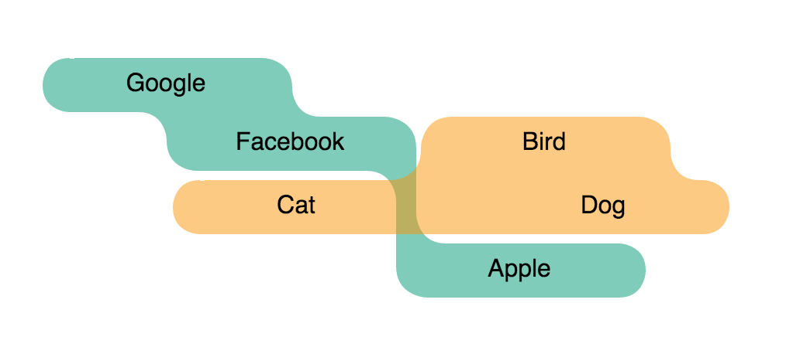
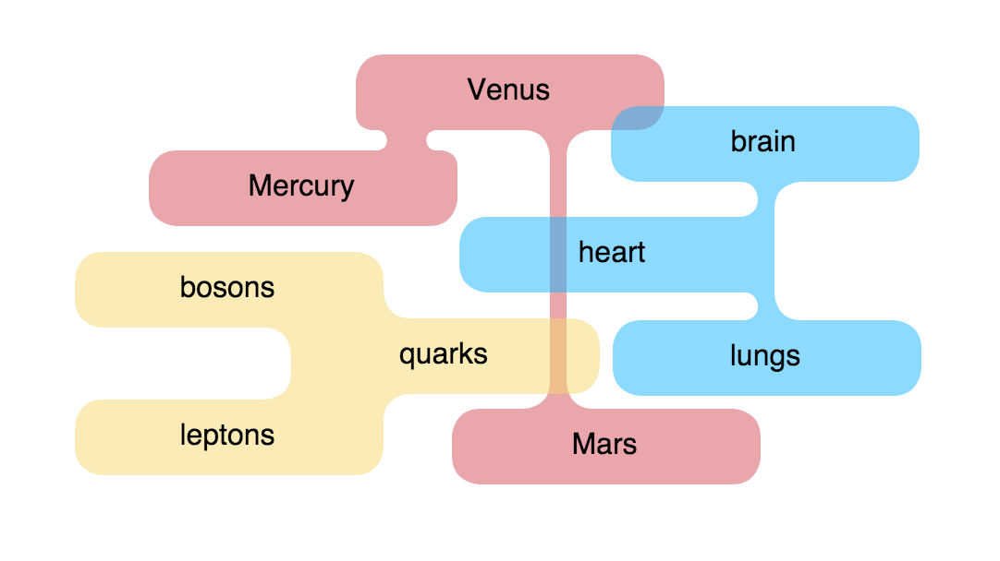

# react-blobber

[](https://travis-ci.org/scienceai/react-blobber)
[](https://www.npmjs.com/package/react-blobber)

Create orthogonal blobs from grouped arrays of rectangles

<p align="center">
  
  
</p>

### Usage

```
npm install react-blobber --save
```

```js
import React from 'react';
import Blobber from 'react-blobber';

const groupLabels = [
  ['Mercury', 'Venus', 'Mars'],
  ['quarks', 'leptons', 'bosons'],
  ['heart', 'lungs', 'brain'],
];

const groupColors = ['#D24D57', '#F5D76E', '#C5EFF7'];

const groupRectangles = [
  [
    { x: 30, y: 250, width: 150, height: 24 },
    { x: 100, y: 285, width: 150, height: 24 },
    { x: 200, y: 310, width: 150, height: 24 },
  ],
  [
    { x: 180, y: 270, width: 150, height: 24 },
    { x: 250, y: 260, width: 150, height: 24 },
    { x: 160, y: 240, width: 150, height: 24 },
  ],
  [
    { x: 50, y: 220, width: 150, height: 24 },
    { x: 200, y: 190, width: 150, height: 24 },
    { x: 250, y: 170, width: 150, height: 24 },
  ],
];

class Example extends React.Component {

  const exampleBlobs = groupRectangles.map((rectGroup, i) => (
    <Blobber
      key={i}
      rects={rectGroup}
      pathOffset={5}
      cornerRadius={10}
      containerStyle={{ width: '100%', height: '100%' }}
      svgStyle={{ fill: groupColors[i], stroke: groupColors[i], opacity: 0.5 }}
      algorithm='convex-hull'
    />
  ));

  render() {
    return (
      <div>
        {exampleBlobs}
      </div>
    );
  }
}
```

###### `props`

+ `rects`: an array of rectangles within a blob group (elements of example `groupRectangles` above)

+ `pathOffset`: blob padding, in pixels

+ `cornerRadius`: blob corner radius, in pixels

+ `containerStyle`: style object for container div

+ `svgStyle`: style object for svg paths

+ `algorithm`: `convex-hull` or `polygon-union`. There are minor differences in appearance between the two algorithms. However, only `convex-hull` currently supports automatic connections between rectanges spaced far apart. `polygon-union` should be able to support this soon.

### Development

`npm run dev` to start the webpack dev server with hot reloading, then go to [http://localhost:3000](http://localhost:3000).

### Build

```
npm run build
```

Outputs to `dist/`.

### Test

```
npm test
```

### License

[Apache 2.0](https://github.com/scienceai/blobber/blob/master/LICENSE)
