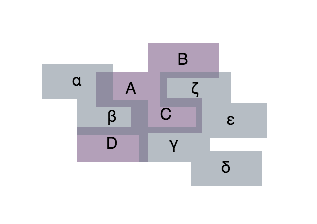

# react-blobber

[](https://travis-ci.org/scienceai/react-blobber)
[](https://www.npmjs.com/package/react-blobber)

Create orthogonal blobs from grouped arrays of rectangles

Example of convex-hull algorithm:

<p align="center">
  
</p>

Examples of polygon-union algorithm:

<p align="center">
  
  
</p>

### Usage

```
npm install react-blobber --save
```

```js
import React from 'react';
import Blobber from 'react-blobber';

const groupLabels = [
  ['Mercury', 'Venus', 'Mars'],
  ['quarks', 'leptons', 'bosons'],
  ['heart', 'lungs', 'brain'],
];

const groupColors = ['#D24D57', '#F5D76E', '#19B5FE'];

const groupRectangles = [
  [
    { x: 142, y: 154, width: 150, height: 24 },
    { x: 254, y: 102, width: 150, height: 24 },
    { x: 306, y: 294, width: 150, height: 24 },
  ],
  [
    { x: 219, y: 245, width: 150, height: 24 },
    { x: 102, y: 289, width: 150, height: 24 },
    { x: 102, y: 209, width: 150, height: 24 },
  ],
  [
    { x: 310, y: 190, width: 150, height: 24 },
    { x: 393, y: 246, width: 150, height: 24 },
    { x: 392, y: 130, width: 150, height: 24 },
  ],
];

class Example extends React.Component {

  render() {

    const exampleBlobs = groupRectangles.map((rectGroup, i) => (
      <Blobber
        key={i}
        rects={rectGroup}
        pathOffset={15}
        cornerRadius={8}
        containerStyle={{ width: '100%', height: '100%' }}
        svgStyle={{ fill: groupColors[i], stroke: groupColors[i], opacity: 0.5 }}
        algorithm='polygon-union'
      />
    ));

    return (
      <div>
        {exampleBlobs}
      </div>
    );
  }
}
```

##### Props

+ `rects`: an array of rectangles for one blob group (example: elements of `groupRectangles` above). A rectangle object consists of `x` and `y` top-left coordinates as well as `width` and `height`.

+ `pathOffset`: blob padding, in pixels

+ `cornerRadius`: blob corner radius, in pixels

+ `containerStyle`: style object for container div

+ `svgStyle`: style object for svg paths

+ `algorithm`: options are `convex-hull` or `polygon-union`. There are minor differences in appearance between the two algorithms. `convex-hull` may not produce optimal results for very complex layouts or groupings, due to convexity requirements. The way `polygon-union` creates extensions between elements may make it more amenable to complex groupings.

### Development

`npm run dev` to start the webpack dev server with hot reloading, then go to [http://localhost:3000](http://localhost:3000).

### Build

```
npm run build
```

Outputs to `dist/`.

### Test

```
npm test
```

### License

[Apache 2.0](https://github.com/scienceai/blobber/blob/master/LICENSE)
